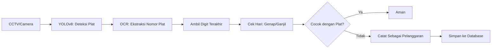

# 🚗 Sistem Deteksi Pelanggaran Aturan Ganjil Genap Plat Nomor di Jakarta

🔗 **Dataset Roboflow**: [Deteksi Lisensi Plat](https://universe.roboflow.com/smartproject/deteksi-lisensi-plat)  
📊 **Presentasi Canva**: [Presentasi Sistem](https://www.canva.com/design/DAGmFxCjSLA/lAMJdL2S9gwEHipRu3azxA/edit?utm_content=DAGmFxCjSLA&utm_campaign=designshare&utm_medium=link2&utm_source=sharebutton)

---

## 📌 Latar Belakang

Aturan ganjil-genap merupakan kebijakan Pemerintah Provinsi DKI Jakarta yang diterapkan sejak 2016 untuk mengurangi kemacetan lalu lintas dan polusi udara. Sistem ini membatasi kendaraan berdasarkan digit terakhir plat nomor dan tanggal kalender.

Contoh:  
- Plat nomor **B 1234 XYZ** → digit terakhir = **4** → **Genap**  
- Maka hanya boleh melintas pada tanggal genap: 2, 4, 6, dst.

---

## 🎯 Tujuan Proyek

- 🔍 **Deteksi Pelanggaran Otomatis**  
  Mendeteksi kendaraan yang melanggar aturan ganjil-genap secara otomatis menggunakan kamera dan model deteksi plat nomor.

- 🗃 **Penyimpanan Data Pelanggaran**  
  Menyimpan data pelanggaran ke dalam basis data termasuk:
  - Nomor plat kendaraan
  - Tanggal & waktu pelanggaran
  - Lokasi (koordinat/GPS/camera ID)

- 📡 **Pemantauan Real-Time**  
  Sistem dapat terintegrasi dengan CCTV jalanan untuk mendeteksi pelanggaran secara langsung.

---

## 📊 Status Proyek

| Fitur                                 | Status        |
|--------------------------------------|---------------|
| Deteksi Plat Kendaraan (YOLOv8)      | ✅ Selesai     |
| OCR Nomor Plat (EasyOCR/PaddleOCR)   | ✅ Selesai     |
| Deteksi Ganjil/Genap Berdasarkan Hari| 🟡 On Progress|
| Pembuatan & Integrasi Database       | 🟡 On Progress|
| Penginputan Data Pelanggaran ke DB   | 🟡 On Progress|

---

## 🛠️ Teknologi yang Digunakan

| Komponen           | Teknologi / Library             |
|--------------------|----------------------------------|
| Model Deteksi      | YOLOv8s (Ultralytics)           |
| OCR Plat Nomor     | EasyOCR / PaddleOCR             |
| Dataset            | Roboflow                        |
| Bahasa Pemrograman | Python                          |
| Lingkungan         | Google Colab + CUDA (Tesla T4)  |
| Framework Tambahan | OpenCV, Pandas, SQLite/MySQL    |

---

## 🔄 Alur Kerja Sistem

---

## 📅 Logika Aturan Ganjil Genap

- **Hari Ganjil**: Tanggal 1, 3, 5, 7, …  
- **Hari Genap**: Tanggal 2, 4, 6, 8, …

**Waktu Berlaku:**  
- ⏰ **Pagi**: 06.00 – 10.00 WIB  
- 🌇 **Sore**: 16.00 – 20.00 WIB  
Di luar jam tersebut, aturan tidak berlaku.

---

## 🧾 Struktur Database Pelanggaran

| Kolom           | Tipe Data         | Deskripsi                          |
|------------------|-------------------|-------------------------------------|
| `id`             | Integer (PK)      | ID unik                            |
| `plate_number`   | Text              | Nomor plat kendaraan               |
| `date`           | Date              | Tanggal pelanggaran                |
| `time`           | Time              | Jam pelanggaran                    |
| `location`       | Text / GPS Point  | Lokasi pelanggaran (opsional)     |
| `image_path`     | Text              | Lokasi penyimpanan foto bukti     |

---

## ⚠️ Tantangan Teknis

- 🌧 **Kondisi Pencahayaan**: Hujan atau malam hari bisa menurunkan akurasi deteksi.
- 🚗 **Kepadatan Lalu Lintas**: Pemrosesan real-time harus tetap cepat meskipun kendaraan ramai.
- 🔎 **Ketepatan OCR**: Membaca plat nomor dengan benar meski blur, miring, atau terhalang.

---

## 📈 Hasil Model

| Metric        | Value     |
|---------------|-----------|
| Precision     | 0.983     |
| Recall        | 0.946     |
| mAP@0.5       | 0.973     |
| mAP@0.5:0.95  | 0.711     |

**Model Info**  
- Model: YOLOv8s  
- Epoch: 20  
- Validasi: 2048 images (2195 objek)  
- GPU: Tesla T4 (RAM 15 GB)  
- Durasi Training: ~0.987 jam (~59 menit)

---

## ✅ Catatan

- 🚧 Fitur pengecekan hari & integrasi database sedang dalam tahap pengembangan.
- 📷 Proses deteksi plat dan nomor sudah berjalan dengan baik.
