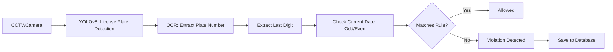

# 🚗 Odd-Even License Plate Violation Detection System in Jakarta

🔗 **Dataset (Roboflow)**: [License Plate Detection](https://universe.roboflow.com/smartproject/deteksi-lisensi-plat)  
📊 **Presentation (Canva)**: [System Presentation](https://www.canva.com/design/DAGmFxCjSLA/lAMJdL2S9gwEHipRu3azxA/edit?utm_content=DAGmFxCjSLA&utm_campaign=designshare&utm_medium=link2&utm_source=sharebutton)

---

## 📌 Background

The odd-even license plate rule is a traffic policy implemented by the Jakarta Provincial Government since 2016 to reduce traffic congestion and air pollution. The system restricts vehicles from operating based on the last digit of their license plate and the date on the calendar.

Example:  
- License Plate **B 1234 XYZ** → last digit = **4** → **Even**  
- This vehicle can only operate on even calendar dates: 2, 4, 6, etc.

---

## 🎯 Project Goals

- 🔍 **Automatic Violation Detection**  
  Automatically detect vehicles violating the odd-even rule using a camera and license plate detection model.

- 🗃 **Violation Data Logging**  
  Store violation records in a database including:
  - License plate number
  - Date and time of the violation
  - Location (GPS or camera ID)

- 📡 **Real-Time Monitoring**  
  The system can be integrated with road surveillance cameras for real-time violation detection.

---

## 📊 Project Status

| Feature                                      | Status        |
|---------------------------------------------|---------------|
| Vehicle License Plate Detection (YOLOv8)    | ✅ Completed   |
| License Plate Number OCR                    | ✅ Completed   |
| Odd-Even Day Violation Detection Logic      | ✅ Completed   |
| Database Creation and Integration           | ✅ Completed   |
| Logging Violation Data to Database          | ✅ Completed   |

---

## 🛠️ Technologies Used

| Component            | Technology / Library         |
|----------------------|------------------------------|
| Detection Model      | YOLOv8s (Ultralytics)         |
| OCR Engine           | EasyOCR / PaddleOCR           |
| Dataset              | Roboflow                      |
| Programming Language | Python                        |
| Runtime              | Google Colab + CUDA (Tesla T4)|
| Libraries            | OpenCV, Pandas, SQLite/MySQL  |

---

## 🔄 System Workflow

---

## 📅 Odd-Even Rule Logic

- **Odd Dates**: 1, 3, 5, 7, etc.  
- **Even Dates**: 2, 4, 6, 8, etc.

**Time Restrictions:**  
- ⏰ **Morning**: 06:00 – 10:00 WIB  
- 🌇 **Evening**: 16:00 – 20:00 WIB  
Outside these hours, all vehicles may operate freely.

---

## 🧾 Violation Database Structure

| Field           | Data Type         | Description                       |
|------------------|--------------------|-----------------------------------|
| `id`             | Integer (Primary)  | Unique record ID                  |
| `plate_number`   | Text               | Detected license plate number     |
| `date`           | Date               | Violation date                    |
| `time`           | Time               | Violation time                    |
| `location`       | Text / GPS Point   | Violation location (optional)     |
| `image_path`     | Text               | Path to violation image snapshot  |

---

## ⚠️ Technical Challenges

- 🌧 **Lighting Conditions**: Nighttime or rainy weather may reduce detection accuracy.
- 🚗 **Traffic Density**: Real-time processing must be fast even under high traffic volume.
- 🔎 **OCR Accuracy**: The system must correctly read license plates despite blur, distortion, or occlusion.

---

## 📈 Model Performance

| Metric       | Value     |
|--------------|-----------|
| Precision    | 0.983     |
| Recall       | 0.946     |
| mAP@0.5      | 0.973     |
| mAP@0.5:0.95 | 0.711     |

**Model Info**  
- Model: YOLOv8s  
- Epochs: 20  
- Validation Images: 2048 (2195 objects)  
- GPU: Tesla T4 (15 GB RAM)  
- Training Duration: ~0.987 hours (~59 minutes)

---

## ✅ Notes

- 🚧 Odd/Even date checking and database integration are currently under development.
- 📷 Plate detection and number recognition are already working correctly.
